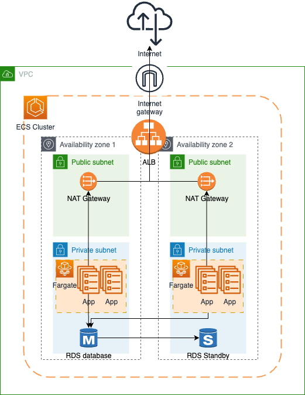

# Terraform ECS Challange

This repo contains terraform files to create an entire infrastrucute to run ECS applications, using a MySQL RDS database.

## Overall Architecture



## Folder Structure

There is a module to create new ECS services as needed, under the modules folder.

```
.
├── README.md
├── alb.tf
├── fargate.tf
├── main.tf
├── modules
│   └── ecs_service
│       ├── autoscale.tf
│       ├── ecr.tf
│       ├── iam.tf
│       ├── outputs.tf
│       ├── service.tf
│       └── variables.tf
├── output.tf
├── provider.tf
├── rds.tf
├── variables.tf
└── vpc.tf
```

## Creating a new app

To create a new app, add the following block to the main.tf file:

```
### - Use this block to create a new service ---###

module "service" {
  source = "./modules/ecs_service"
  name   = "<app name>"
  container_name = "<container name>"
  image = <container image URL>
  cluster = aws_ecs_cluster.test
  subnet_id1 = aws_subnet.private.id
  subnet_id2 = aws_subnet.private2.id
  vpc_id = aws_vpc.test.id
  health_check_path = "/"
}

resource "aws_lb_listener" "prod" {
  load_balancer_arn = aws_lb.test.arn
  port              = <container port>
  protocol          = "HTTP"

  default_action {
    target_group_arn = module.service.target_group_arn
    type             = "forward"
  }
}

### --- END of service block ---###
```